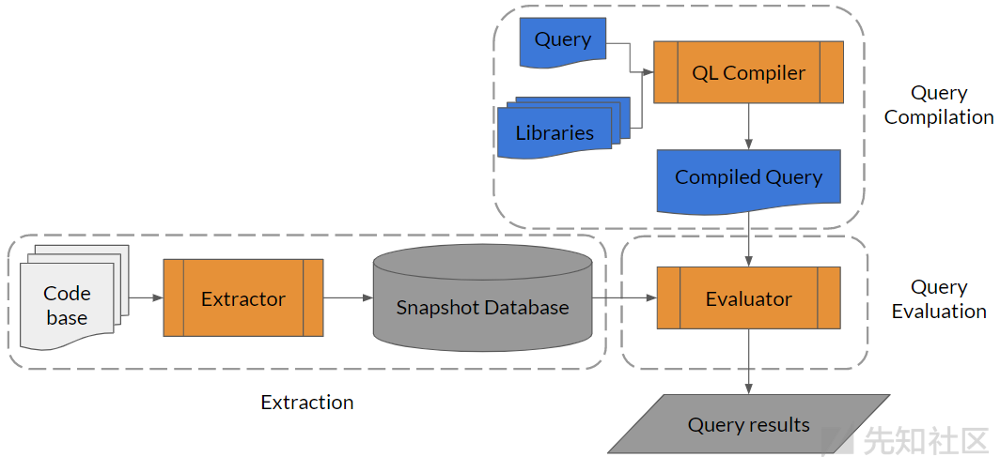

[CodeQL documentation](https://codeql.github.com/docs/index.html)

codeql本身并不是开源的，二进制文件都是加壳的，更别说开源了。

# Background

Learn more about how CodeQL works, the languages and libraries supported by CodeQL analysis, and the tools you can use to run CodeQL on open source projects.

## About CodeQL

CodeQL is the **analysis engine** used by developers to **automate security checks**, and by security researchers to perform **variant analysis**.

In CodeQL, **code is treated like data**. Security vulnerabilities, bugs, and other errors are **modeled as queries** that can be executed against **databases extracted from code**.   代码首先会被提取成数据，放到数据库中，之后query去查。

CodeQL analysis consists of three steps:

1. Preparing the code, by creating a CodeQL database
2. Running CodeQL queries against the database
3. Interpreting the query results

### Database creation

To create a database, CodeQL **first extracts a single relational representation of each source file** in the codebase.

For compiled languages, extraction works by **monitoring the normal build process**. Each time a compiler is invoked to process a source file, a copy of that file is made, and all relevant information about the source code is collected. This includes **syntactic data about the abstract syntax tree** and **semantic data about name binding and type information**.	即借助正常编译，提取语法和语义信息。

For interpreted languages, the extractor **runs directly on the source code**, resolving dependencies to give an accurate representation of the codebase.	对于解释型语言，extractor直接对源码进行分析，提取依赖关系。

There is one [extractor](https://codeql.github.com/docs/codeql-overview/codeql-glossary/#extractor) for each language supported by CodeQL to ensure that the extraction process is as accurate as possible. For multi-language codebases, databases are generated one language at a time.	每种支持的语言都写了一个extractor。对于多语言项目，一次只能生成一种语言的database

After extraction, all the data required for analysis (**relational data, copied source files, and a language-specific [database schema](https://codeql.github.com/docs/codeql-overview/codeql-glossary/#codeql-database-schema), which specifies the mutual relations in the data**) is imported into **a single directory, known as a [CodeQL database](https://codeql.github.com/docs/codeql-overview/codeql-glossary/#codeql-database)**.	所有分析需要的数据（关系型数据等），都放在一个文件夹下，就是所谓的database。

### Query execution

After you’ve created a CodeQL database, one or more queries are executed against it. CodeQL queries are written in a specially-designed **object-oriented** query language called QL.	QL也是面向对象的

### Query results

The final step converts results produced during query execution into a form that is more meaningful in the context of the source code. That is, **the results are interpreted** in a way that highlights the potential issue that the queries are designed to find.

**Queries contain metadata properties that indicate how the results should be interpreted.** For instance, some queries display a simple message at a single location in the code. Others display a series of locations that represent steps along a data-flow or control-flow path, along with a message explaining the significance of the result. **Queries that don’t have metadata are not interpreted**—their results are **output as a table and not displayed in the source code**.	查询结果也可以在源代码中展现

### About CodeQL databases

CodeQL databases contain queryable data extracted from a codebase, for a single language at a particular point in time. The database contains a full, **hierarchical representation** of the code, including a representation of the **abstract syntax tree, the data flow graph, and the control flow graph**.

**Each language** has its **own unique database schema** that **defines the relations** used to create a database. The schema provides an interface between the initial lexical analysis during the extraction process, and the actual complex analysis using CodeQL. The schema specifies, for instance, that there is a table for every language construct.

For each language, the CodeQL libraries define classes to provide a layer of abstraction over the database tables. This provides an object-oriented view of the data which makes it easier to write queries.	

For example, in a CodeQL database for a Java program, two key tables are:

- The `expressions` table containing a row for every single expression in the source code that was analyzed during the build process.
- The `statements` table containing a row for every single statement in the source code that was analyzed during the build process.

The CodeQL library defines classes to provide a layer of abstraction over each of these tables (and the related auxiliary tables): `Expr` and `Stmt`.


### Glossary

- `.bqrs` file  	A binary query result set (BQRS) file. BQRS is the **binary representation of the raw result of a query**, with the extension `.bqrs`. A BQRS file can be interpreted into meaningful results and related to your source code. 

- CodeQL database     A database (or CodeQL database) is a directory containing:

  - queryable data, extracted from the code.
  - a source reference, for displaying query results directly in the code.
  - **query results**.       result也放在database文件夹下
  - **log files** generated during database creation, query execution, and other operations.

- DIL       DIL stands for Datalog Intermediary Language. It is an **intermediate representation between QL and relation algebra (RA)** that is generated during query compilation. DIL is useful for advanced users as an aid for **debugging query performance**.            相当于QL的汇编 

  - When you specify the `--dump-dil` option for `codeql query compile`, CodeQL prints DIL to standard output for the queries it compiles. You can also view results in DIL format when you run queries in VS Code.

- Extractor       An extractor is a tool that produces the relational data and source reference for each input file, from which a CodeQL database can be built.

- QL database schema         A QL database schema is **a file describing the column types and extensional relations that make up a raw QL dataset**. It is a text file with the `.dbscheme` extension.

- `.qlo` files          `.qlo` files are optionally generated during query compilation. If you specify the `--dump-qlo` option for `codeql query compile`, CodeQL writes `.qlo` files for the queries it compiles.   `.qlo` is a binary format that represents a compiled and optimized query in terms of relational algebra (RA) or the intermediate [DIL](https://codeql.github.com/docs/codeql-overview/codeql-glossary/#dil) format.

- SARIF file        Static analysis results interchange format (SARIF) is an output format used for sharing static analysis results.

- TRAP file         A TRAP file is a UTF-8 encoded file generated by a CodeQL extractor with the extension `.trap`.  They contain the information that, when interpreted relative to a QL database schema, is used to create a QL dataset.




# CodeQL for VScode

环境配置以及更多功能使用见[官方文档](https://codeql.github.com/docs/codeql-for-visual-studio-code/setting-up-codeql-in-visual-studio-code/)

测试样例选择https://github.com/hac425xxx/sca-workshop.git

建立database，到要分析源码的根目录，执行`codeql database create --language=cpp -c "gcc hello.c -o hello" ./hello_codedb `

```
--language=cpp  指定语言是cpp
-c 指定编译代码需要执行的命令命令，比如 make、 gcc等
./hello_codedb 数据库相关文件保存的路径
```


之后编写自己的CodeQL脚本，并将脚本保存至`vscode-codeql-starter\codeql-custom-queries-cpp`处。之后在vscode中右键该.ql文件，选择Run on queue，即可开始查询。


>对于多个ql文件，vscode目前已经支持ctrl多选文件。可以多选文件后右键，去执行多个query


# ql grammar

基本查询结构：

```sql
/**
 *
 * Query metadata
 *
 */

import /* ... CodeQL libraries or modules ... */

/* ... Optional, define CodeQL classes and predicates ... */

from /* ... variable declarations ... */
where /* ... logical formula ... */
select /* ... expressions ... */
```


## types

QL是静态类型语言，每个变量都必须有一个声明的类型。

The kinds of types in QL are [primitive types](https://codeql.github.com/docs/ql-language-reference/types/#primitive-types), [classes](https://codeql.github.com/docs/ql-language-reference/types/#classes), [character types](https://codeql.github.com/docs/ql-language-reference/types/#character-types), [class domain types](https://codeql.github.com/docs/ql-language-reference/types/#domain-types), [algebraic datatypes](https://codeql.github.com/docs/ql-language-reference/types/#algebraic-datatypes), [type unions](https://codeql.github.com/docs/ql-language-reference/types/#type-unions), and [database types](https://codeql.github.com/docs/ql-language-reference/types/#database-types).

### 基础类型

1. **boolean**: This type contains the values `true` and `false`.
2. **float**: This type contains 64-bit floating point numbers, such as `6.28` and `-0.618`.
3. **int**: This type contains 32-bit [two’s complement](https://en.wikipedia.org/wiki/Two's_complement) integers, such as `-1` and `42`.
4. **string**: This type contains finite strings of 16-bit characters.
5. **date**: This type contains dates (and optionally times).

### 类

To define a class, you write:

1. The keyword `class`.
2. The name of the class. This is an [identifier](https://codeql.github.com/docs/ql-language-reference/ql-language-specification/#identifiers) starting with an uppercase letter.
3. The types to extend.
4. The [body of the class](https://codeql.github.com/docs/ql-language-reference/types/#class-bodies), enclosed in braces.

For example:

```
class OneTwoThree extends int {
  OneTwoThree() { // characteristic predicate
    this = 1 or this = 2 or this = 3
  }

  string getAString() { // member predicate
    result = "One, two or three: " + this.toString()
  }

  predicate isEven() { // member predicate
    this = 2
  }
}
```

​	也有抽象类，在class前面加上abstract

## 谓词

谓词就是类似于函数的存在。

When defining a predicate, you should specify:

1. The keyword `predicate` (for a [predicate without result](https://codeql.github.com/docs/ql-language-reference/predicates/#predicates-without-result)), or the type of the result (for a [predicate with result](https://codeql.github.com/docs/ql-language-reference/predicates/#predicates-with-result)).
2. The name of the predicate. This is an [identifier](https://codeql.github.com/docs/ql-language-reference/ql-language-specification/#identifiers) starting with a lowercase letter.
3. The arguments to the predicate, if any, separated by commas. For each argument, specify the argument type and an identifier for the argument variable.
4. The predicate body itself. This is a logical formula enclosed in braces.

即：

```
predicate name(type arg)
{
  statements
}
```

### 无返回值谓词

These predicate definitions start with the keyword `predicate`. If a value satisfies the logical property in the body, then the predicate holds for that value.

For example:

```sql
predicate isSmall(int i) {
  i in [1 .. 9]
}

from int i 
where isSmall(i) // 将整数集合i从正无穷大的数据集含，限制至1-9
select i
// 输出 1-9的数字
```

If `i` is an integer, then `isSmall(i)` holds if `i` is a positive integer less than 10.	即如果i符合isSmall谓词中的body，就保留i的值。


### 有返回值谓词

You can define a predicate with result by **replacing the keyword `predicate` with the type of the result**.

```sql
int getSuccessor(int i) {
  // 若传入的i位于1-9内，则返回i+1
  // 注意这个语法不能用C++语法来理解
  result = i + 1 and i in [1 .. 9]
}
  
select getSuccessor(3)  // 输出4
select getSuccessor(33) // 不输出任何信息
```

​	and为逻辑连接词，只有i满足1-9，result赋值右边这个表达式才有效。


### 递归

```sql
string getANeighbor(string country) {
  country = "France" and result = "Belgium"
  or
  country = "France" and result = "Germany"
  or
  country = "Germany" and result = "Austria"
  or
  country = "Germany" and result = "Belgium"
  or
  country = getANeighbor(result)
}
select getANeighbor("Austria")
// 输出Germany
```


