# Parsing

正则无法解决括号匹配这样的问题。 DFA只适合解决token识别，状态机。   不适合去记录token间的嵌套层次，不然会多出很多不实用的分叉去表示嵌套等状态。  所以专门搞一个parse，来分析语法。

## 文法

文法grammar就是用来描述句子的构成规则的。

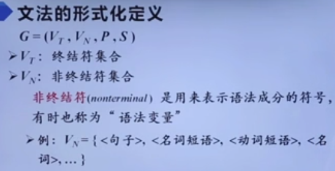

**因为可以从他们推导出其他语法成分，所以叫 非终结符。**

根据对文法产生式的不同要求，将文法分为4类

左边a的符号个数不能多于右边b的符号个数

之所以上下文有关，是因为当非终结符A的上下文是a1和a2时，才能替换为B。 所以说上下文有关的。

​	空产生式是指右部b为空的产生式。  因为a至少包含一个非终结符，所以右边不可能为空。

上下文无关文法 左部为非终结符。

产生式左边都是非终结符。  正如上面，非终结符往往都是指代一个产生式，从而可进行替换。

​	正则文法可以描述单词，但无法描述句子构造。所以上下文无关文法用的最多。

结点是左部A，非终结符。子结点都是右部的元素。

​	**所有叶结点的从左到右的组合，就是整个树的产出，或者叫边缘。**

​	**叶结点才代表终结符！！内部结点都是非终结符，代表一些语法成分标记**

分析树不是固定的，对于每一个句型，都可以构造出一个分析树。 并且句型中元素可以由其他句型来替换，这样分析树也不同。

子树的结构就叫短语。 整个树的结果就是**整句话**的产出。

推导流程：

产生式就是“替换”规则。

最终全部推导成终结符。

终结符就不能被替换了。 **终结符就是tokens**

### derivation

派生，由树表示

**树就更结构化，可以知道哪部分算作一个整体，需要先进行计算！！**

每步只能替换一个非终结符！！

​	leftmost derivation就是每步都是替换最左边的非终结符。

lestmost和rightmost永远都拥有相同的parse tree。因为这里只是添加子树的顺序不同，而子树之间并不互相影响。

​	当然也有其他的derivation 顺序，只不过leftmost和rightmost用的最多。

### ambiguity

derivation不同，parse tree就有可能不同。 但是不同derivation也可能得到相同的parse tree。 如leftmost和rightmost

​	如果parse tree不同，那么很有可能是因为一个非终结符有多个符合要求的产生式。产生式的选择造成Parse tree不同。   语法grammar就是由产生式构成的。

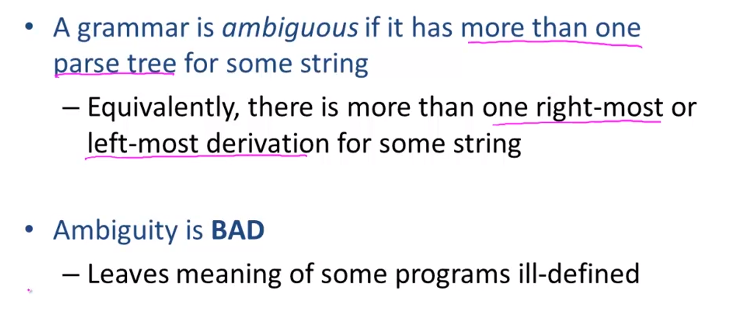

这就造成二义性。

**一般都是在ambiguous grammer中加入消歧规则**，而不是重写grammer

​	**只要一个语句能产生2种及以上parse tree，就认为是ambiguous的，不管这些parse tree之间是否等效。**

注意到，要先做的，都是在树靠近叶结点的方向。 优先级低的，在root方向。

## Error Handling

三种error handling方式

前两种在现代编译器用的比较多。

**即不能识别的部分抛出异常，剩余部分正常编译。**

这就像gcc的warning.    

## AST

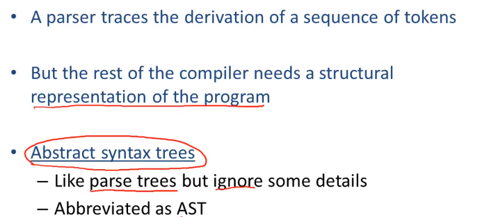

只有单子节点的结点可以直接被子节点的值替换。    括号这些因为都已经形成树，已经确定好结构了，所以不再需要括号。

ast比普通语法树更简洁

## Recursive Descent Parsing

注意，**token是终结符**！！  非终结符都是些句子成分标记之类的，如forStatement。  所以**token在语法树中只是叶结点**。

​	**递归下降算法**是top-down自上而下，从左到右的。

算法就是对于每条产生式，我们都按顺序尝试一下，如果不行就换下一条产生式。	检查是否正确的方式，就是当推导到一个终结符时，判断该终结符和token流中的下一个token是否匹配。   若匹配，则说明可能成功，**接着验证右边的子节点**。  	

​	所以说，从上到下尝试遍历推导式，产生子节点后，从左到右遍历子节点。若子节点为终结符，那么从token流去验证下一个token是否为这个。若为非终结符，那么就递归去推导这个非终结符。    如果有不匹配的地方，就回退到上面，换下一个推导式。

​	整体过程**有点像回溯法**。从top开始就作假设，然后在假设基础上去建树。等回溯到top时，就说明整体都是正确的。				**深度优先去构建树**

再说明一下，grammar中设定的终结符，有很大部分都是token类型。因为token有很多都是变量，grammar并不知道具体的变量名，所以grammar描述中，都是用的token类型。那么**验证的时候，也是检查的token类型是否符合**。

形式化描述：

注意 指针++，是指以数据类型为单元的下一个位置

初始化，并启动程序

### limitations

如上图，如果我们按递归下降这种深度优先去匹配产生式，那么如果先匹配到的产生式并不正确，如正确的是T-> int*T，而不是T-> int。那么这时就认为这句话解析完了，但是剩下\*int，所以错误。

​	产生错误的原因，**是因为“抢占”式匹配，确定一个产生式后就固定了，无法backtrack**。通过之后其他结点的检查，或token有剩余等情况，就会发现之前确定的产生式有可能是错误的。

​	所以最简单，正确的方法，还是需要遍历所有情况。当然，**只要整个树能建立起来，没发现问题，就可以认为这是正确的。因为grammar已经消除二义性了**！！  	所以实际上还是回溯法，只需要提供可以backtrack到任意位置的功能即可，不用完全遍历所有可能！！

前面讲述的递归下降算法，并不是全面的。 真正的算法需要对此进行改进，使之能backtrack“已确定”的产生式，来适应所有情况。

### left recursion

因为右边如果一直有相同的非终结符消不掉的话，就会造成无穷递归。

## Predictive Parsing

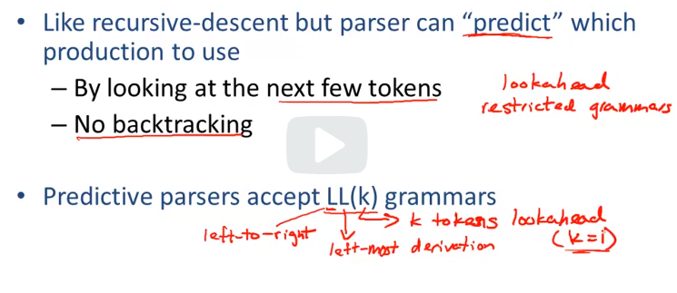

和递归向下一样，**预测性分析也是top-down的**。之所以是“预测”，是因为**parser会look ahead几个token，去预测所用的产生式。不会出错(依靠grammar)，所以不会backtrack，是确定性的。**

​	**left-to-right parse，指从左到右解析input;**

​	**leftmost是指derivation是每次替换最左边的非终结符；**

像这种grammar，我们需要重构它，才能适合于预测性parse，通关look ahead能区分出来

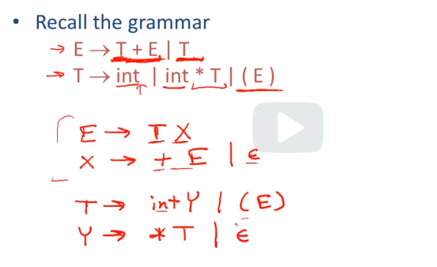

重构的目标就是**消除多个产生式的共同前缀**，从而**可以通过look ahead去区分要用哪个产生式**。

​	方法就是**多添加一个子产生式，将共同前缀当作一个专门的产生式，从而子产生式中就没有共同前缀了**。

解析表：

和DFA类似，都是提前根据所有可能去构建一个“状态机”，然后去parse。 毕竟grammar都是固定好的，所以只要查表即可。

使用表去parse的流程：

用stack去记录todo的元素。

T就是parsing table     **t是指还没匹配到input的终结符。  rest就是stack中剩余的部分**

因为是LL，left-most，所以所有non-terminal替换都是最左边，然后把rest放在右边！！

​	$只是为了标识end of input，作为parse终结标志。因为LL是leftmost，所以$会一直留到最后，直到左边都是terminal，说明parse完成。

​	leftmost，也符合输入顺序。因为树的叶结点，从左到右排序，就是input的顺序。我们**验证顺序，也是leftmost，也就是说，并不意味着创建了非终结符结点，就会匹配input**。 若此非终结符结点在右边，那么还是会先拓展左边的子树，才匹配右边这个结点。因为**该节点对应的input token是在中间位置，前面的属于左子树**！！	（当然也可能创建子树时，先递归刚创建的结点，之后再创建其他兄弟结点。这样出错的话，兄弟节点就不用创建了。当然在predictive parsing中因为不会出错，所以不用考虑这个）					即后序遍历。

说是stack，解析顺序更像是队列。   最左边在栈顶，倒序入栈。

​	整体思想和下面的bottom-up类似，只不过是leftmost derivation，每次匹配栈中最左边的symbol。

### first sets

**构造表，就是到对同一个非终结符的多个产生式进行筛选，选出唯一正确的那个。 筛选的依据就是看接下来的token，走哪条产生式最终能匹配。**   这里要注意，进行**筛选可能会潜入到下面好几层，直到找到look ahead token对应的终结符，才能确定。** 因为下一个产生式可能都是非终结符，所以还要往下看，不然还是无法判断。

- 第一种情况，**t是产生式中的第一个symbol**，那么可以直接确定选用这个产生式。 此时t属于First(a)
- 第二种情况，A推导不出t，那么此时只有一种可能可以使该产生式成功，就是A推导出空epsilon，并且A之后就紧接着是t。也就是说，**A整个子树不需要任何输入（即没有终结符，只有一种可能，即为空），那么下一个token t对应着A子树右边的第一个终结符。**     此时t属于Follow(A)

**first sets(X)就是指，该非终结符X能推导出的所有第一个终结符token集合。** 不仅包括X的所有产生式中的位于第一个symbol的终结符（在此之前左边可推导为空），还有空epsilon，如果X可以通过Ai推导出空（有可能即可），还有子产生式的first set。     【空epsilon是给follow set派上用场做准备的】

​	**对于子产生式的first set也属于上层first set，这样就能更早的指定正确的产生式，或判断出token不可推导。**

​	注意看第三条，X产生式右边的第一个非终结符的first set，也属于X的first set！！    也就是说，**first set包含所有的可能，需要推导好几层的第一个非终结符也算。**

### follow sets

follow set(X)就是指可以**经过推导后，X右边紧挨着的终结符的所有可能的集合**。

**与first set同样，follow set也包含所有的可能。 如x->AB，B的整个first set就属于A的follow set！！**    

​	考虑x替换为产生式右边，那么x的后面紧挨的终结符也可以被B紧挨，所以x的follow set也属于B的follow set。	注意，这里考虑的是所有情况，x可以任意替换！！

空属于First(B),也就意味着B有可能替换为空。

​	注意，**follow set不含空epsilon！！ follow set只考虑token**。    **first set包含空epsilon是因为要考虑有的look ahead时，没有input了，但是还有非终结符需要继续推导**。

**终结符也有follow set！！     而终结符的first set就是自身，因为无法推导替换，自身就符合要求。**

### LL1 Parsing Tables

table的y轴就是各个非终结符（CFG产生式的左边）。table的作用就是确定非终结符如何被替换。	所以token看的是目标产生式右边的first set及其为空的follow set，从而得知该产生式能不能用。    **因为first set标识的就是a这个产生式右边之后被替换为全终结符的情况。**			**若要在A的基础上选产生式，因为A已经确定了，所以是看a的first set，来判断a有没有希望有t。**

​	根据上图，构建表是通过遍历每个A的产生式，再遍历集合中的每个元素填写表项。

​	注意到，epsilon都是为了提取完共同前缀后的可能产物（存在于新添加的子式）。其他情况下，grammar是不会有epsilon的。

此时有可能会考虑到，如果一个表项中有2种产生式符合要求怎么办？？    那么只能说明，该grammar不是LL(1)的。        如下图

​	我们上面介绍的构建表的方法，只是针对LL1的，其他parsing方法并不适用。LL1 grammar可以保证LL1 parsing table每项至多只有1个产生式。

​	其实，检查grammar是否是LL1的方法，就是构建一个LL1 parsing table，看是否有多产生式的情况。

​	**大多数语言，都不是LL1 grammar**。         这里介绍LL1只是提供parsing思想：根据产生式去适配.

## Bottom-UP Parsing

​	top-down主要是依靠 **试错+backtrack 或 构造parsing表** 去确定产生式，都并不是根据具体的input结构来分析的（如+和*的优先级）。**top-down的结构实际上与input中优先级相反，优先级高的先作为一个整体运算，那么在tree中就是一个更靠近叶结点的子树。而优先级低的，更靠近root**。所以对于top-down来讲，input的优先级运算顺序与构建tree的顺序完全相反。

相比之下，**bottom-up是更通用的parsing策略，被更多的编译工具使用**。

​	bottom-up就完全是根据input去推产生式，而没有“爆破”的意味。但是还是需要look ahead，消除backtrack的情况。

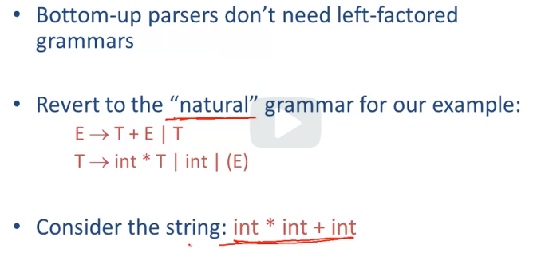

left-factor就是提取公共前缀，来消除ambiguous。 对于bottom-up来讲，不用left-factor。 即**bottom-up可以处理ambiguous grammar**。

bottom-up的目标，就是从input根据产生式“反向推导”到start symbol。

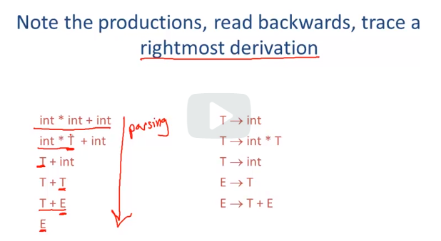

bottom-up推导时，也是leftmost，那么我们从正向看的话，从E开始，就是rightmost顺序。

​	注意，rightmost只是在每一步去reduce最右边的symbol，是局部的顺序方向。整体上，input parse还是left-to-right的。

所以，可以理解为bottom-up记录一个**rightmost derivation的反向过程**。

实际反向推导时还是leftmost，那么就一次推导一步（一个产生式）  当然，因为是反向推导，是将terminal推导到non-terminal，所以**有些terminal不一定非要在前面就被替换**。因为产生式右边，是终结符和非终结符的混合。

​	如上图第一个int，在第一步就没有被替换，而是等到第二步。

​	**bottom-up整体的构建顺序，是符合input执行顺序的。先构建子树整体，再拼接子树。**

### Shift-Reduce Parsing

我们从rightmost角度看，如果w不全是终结符，那么肯定被替换的是w中的symbol，还轮不到B。所以此时w中全是终结符。

那么right substring全是终结符；left substring是已经bottom-up parse过的部分，所以为终结符和非终结符的混合。

​	两个substring的分隔符为一个vertical bar "|"

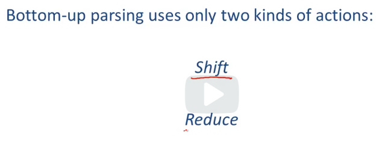

bottom-up parse需要2种操作：shift和reduce

**shift:**

**reduce:**

先shift，在reduce(反推)

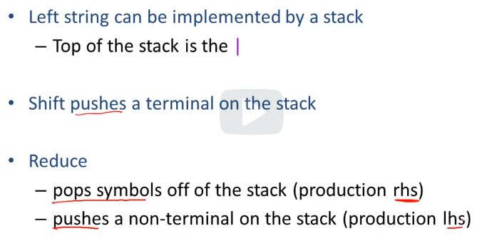

**整个shift-reduce过程可以用stack实现**！！

​	**栈初始化为空！！由input push进栈，再reduce，去一点一点扩充栈内数据。最终栈内全reduce，只剩下start symbol S.**

parse过程中可能有一些conflict

- 在一个位置上是该shfit还是该reduce? (如一开始例子的int*int)
- 在一个位置上有两种reduce产生式可选，选哪个？？

要解决这样的conflict，要么调整grammar，要么给出hint，即一些消歧规则。

### Handles

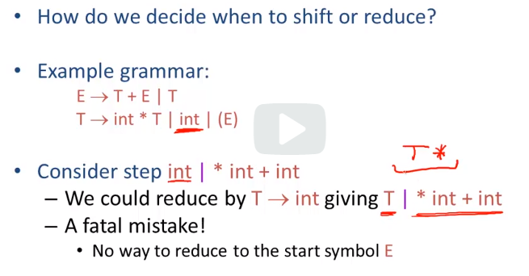

一个关键的问题是：如何判断该shift还是reduce??

->*就是指经过了多次reduction

**handle句柄就是一个“正确”的reduction，能保证从input推到start symbol。**

​	所以我们只要每次都在handle处reduce，就能成功parse.

根据我们的shift-reduce算法，遇到handle就进行reduce，所以handle只会在分隔符|处，不会在左子字符串中。    最多有可能左边有handle的一部分，另外一部分在右边或刚刚reduction的结果（参考int*int）

那么整个bottom-up parsing核心就是去识别handles（就像predictive parsing去构建表一样）.

### Recognizing Handles

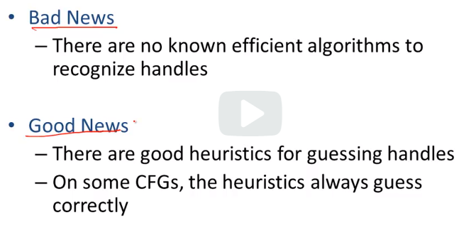

目前没有什么有效的算法去识别handles，但有一些启发式的方法可以去猜handles.

SLR是Simple Left-to-right Rightmost

https://blog.csdn.net/zuzhiang/article/details/79047743

LL(1)分析法是自上而下的分析法。LR(0),LR(1),SLR(1),LALR(1)是自下而上的分析法。

自上而下:从开始符号出发，根据产生式规则推导给定的句子。用的是推导。

自下而上:从给定的句子规约到文法的开始符号。用的是归约。

下面就主要来讲解他们的不同点， LL(1)单独讲，其他四种文法分析过程基本有三大步：写出自动机（即 LR(0)或 LR(1)项集族，后面都称作自动机） -> 构造文法分析表-> 进行文法分析过程。其中后两步都是类似或者说几乎完全一样的，第一步中的自动机有两种: LR(0)自动机和 LR(1)自动机。LR(0) 和 SLR文法分析用的是 LR(0)自动机，LR(1)和 LALR文法分析用的是 LR(1)自动机。而LR(1)自动机构造方法和LR(0)自动机的构造方法相同，只是多增加了向前搜索符号。

parser只知道stack，并不知道后面的input

viable prefix就是指一个handle在|前的一部分。

​	只要在栈中（|前的一部分）还有viable prefix，那么就说明目前没错误（不然栈中内无viable prefix，就说明栈中的symbol无法reduce了，就说明有error）

这就说明了viable prefixes可由状态机识别。  (词法分析是正则->NFA->DFA->token)

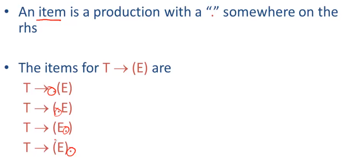

如上图，T->(E)产生式有4个item

正确的parsing，栈中始终全是prefix.	另外，后面的prefix reduce后，会成为前面prefix reduce的后半部分。

即识别一系列产生式右边的一部分。最终不断reduce，产生一个产生式右部分的suffix.

### Recognizing Viable Prefixes

这里就是bottom-up的重点

“.”的作用就是|分隔符，表明现在哪些部分在stack中

​	一个term就是一个NFA的状态。   NFA是所有可能的集合。

​	有2种状态转移：	**转移条件就是下一个入stack的symbol(包含input的终结符和刚reduce产生的非终结符)**

- 一个是下一个input就是X(若X是非终结符，那么说明这是刚reduce出来的)，那么直接push进stack；
- 另一个，如果下个input不是X（X是非终结符），那么就说明有可能接下来的input都是来组成X的（即语法树的优先级高的子树），那么就把state切换为X的产生式，先去尝试reduce出X                此时转移条件为空epsilon，所以这属于NFA

NFA中每一个状态都是正确parse的状态，即stack中全是prefix。

**NFA初始状态，注意看"."的位置，是指目前stack为空，目标就是reduce出grammar的start symbol**					

**NFA的每个final state都是一个reduction**

NFA的好处就是从一个state转移有很多种可能，我们可以直接表示。

​	**NFA实际上就相当于LR(0)的表，去除了每个状态下不正确的input，但是没有look ahead！！**   **但是仔细看NFA，可以发现，NFA只是描述了单个产生式的reduce过程，那么对于一个产生式reduce后，并不意味着这个reduction是正确的！！ 这有点像top-down的回溯，需要根据后面的情况去backtrack.         所以后面的SLR(1)，就在NFA的基础上look ahead，去筛掉backtrack(即导致后面出错)的reduction选择。**

​	**NFA的作用，其实就是列出单个产生式正确的reduction路径。只要顺着NFA走，肯定会reduce出一个产生式，但不确保该reduction是handle,使全局正确。**

​	将NFA转换成表，这样parse时就可以直接查表，而不是当场再遍历所有产生式，这样更快。

**遇到一个final state(reduction)后，就把reduce出来的非终结符push进栈，NFA也回到上一个转移条件为空epsilon处，即上一个prefix的state。**

### Valid Items

转换成DFA

DFA中每个state包含多个产生式。只要满足其中一个产生式，就满足该state.

这就属于LR(0)，rightmost，因为NFA看的就是rightmost顺序。

item只是NFA中的一个状态，表明目前parse最有可能的（或者来说是正确的parsing所期望的）handle是哪个

### SLR Parsing

当“.”在最右边时，说明已经parse到了该产生式右边的所有symbol，可以reduce了。

**这里一个state有多个item，是针对DFA来说的。**   所以conflict也表现在DFA的state上。如下图：

**conflict就有可能导致不能成功推导回start symbol，如int*int这个例子。 所以就像predictive top-down一样，需要look ahead，除去不是全局成功的reduction。    当然，前面说了，没有算法可以推出handles，所以SLR只是一个启发式的方法去猜handle.**

**通过look ahead next input t来判断该reduce还是shift**

​	所以现在根据SLR规则，只要t不属于Follow(X)，那么如果reduce出了X，下一个input t之后就没有可能reduce了，所以只能shift.

​	**如果t不属于Follow(X)或任何产生式的下一个token，那么就说明出现parsing error**

如果在SLR规则下parsing还是有conflict，那么说明该grammar就不是SLR grammar(与LL1同理)

​	SLR规则就作为启发式方法，去猜handles。 SLR grammar就是完全符合SLR规则的grammar

这个就是如果下一个input就是+，但是现在处在E->E*E的情况，那么是先reduce，还是先shift，接受+？    根据precedence declaration优先级规则，\*优先，所以先reduce.

#### 形式化流程

注意，现在reduce之前必须检查next input是否属于reduce出的非终结符的Follow集。只有属于，才有可能使a继续和X去reduce。

**遇到一个final state(handle)后，就把reduce出来的非终结符push进栈，NFA也回到上一个转移条件为空epsilon处，即上一个prefix的state。**     因此，我们**需要记录每个prefix的state，用于reduce后的状态回溯**（下一节improvement就会讲）

​	shift就是指DFA的状态转移！！

### SLR Improvements

**说是存储prefix的state，但是我们并不知道哪些symbol组成一个prefix，所以只能每个symbol都记录自己的state。每次reduce handle后，回溯到剩下的最靠近stack top的symbol的state.**

​	其实可以把reduce出的结果当作next input，这样实现时更方便。

### Example

其实，**DFA每个state，根本不用看其中的items，我们使用DFA时，只是根据input不断转移状态，最终到达final state，再回溯。 每接受一个input symbol，就会转移一次状态。**	在这个过程中我们根本不用考虑具体的item，**只用关心最终的final state，因为需要reduce，通过final state的item去知道如何替换。** 【注意看state 3，其实**只要"."在产生式末尾，就意味着该reduce了，那么所在的state就是一个“final state”**。   这里final state由于还有其他产生式，所以可以继续转移。】

​	而每次reduce，就是构建树的一个内部结点。一直这样递归到生成树的start symbol，即根结点。

​	另外要注意，**消歧规则在构建NFA就已经加入了，由NFA生成的DFA自然就包含消歧规则。**

​	至于**reduce操作如何实现**，最直接的办法（我能想到的）就是**存储DFA每个state中的final产生式，如果next input t不是该state的转移条件，且t属于Follow(X)，那么这时根据stack内的元素去匹配final产生式，去得到该reduce的产生式**，然后执行reduce操作。

### 总结

总的来说，bottom-up不look ahead的话，也面临着和top-down一样的问题，需要backtrack。所以提出SLR(1)去look ahead，消除conflict（实际上就是排除不能全局成功的reduction）。当然，所有parsing都对grammar有一定要求。

自上而下分析的方法是产生语言的自然过程。但是对于分析源程序来讲，**自下而上分析**的方法更自然，因为语法分析处理的对象**一开始都是终结符组成的串**，而不是文法的开始符号。

同时，自下而上分析中最一般的方法，LR方法的能力比自上而下分析的LL方法要强，从而使得**LR分析**成为最为实用的语法分析方法。     个人不成熟分析：因为LL去预测，是根据first和follow集合，而这两个包含了所有可能情况；LR依据状态机，集合更精确。   ？？？

